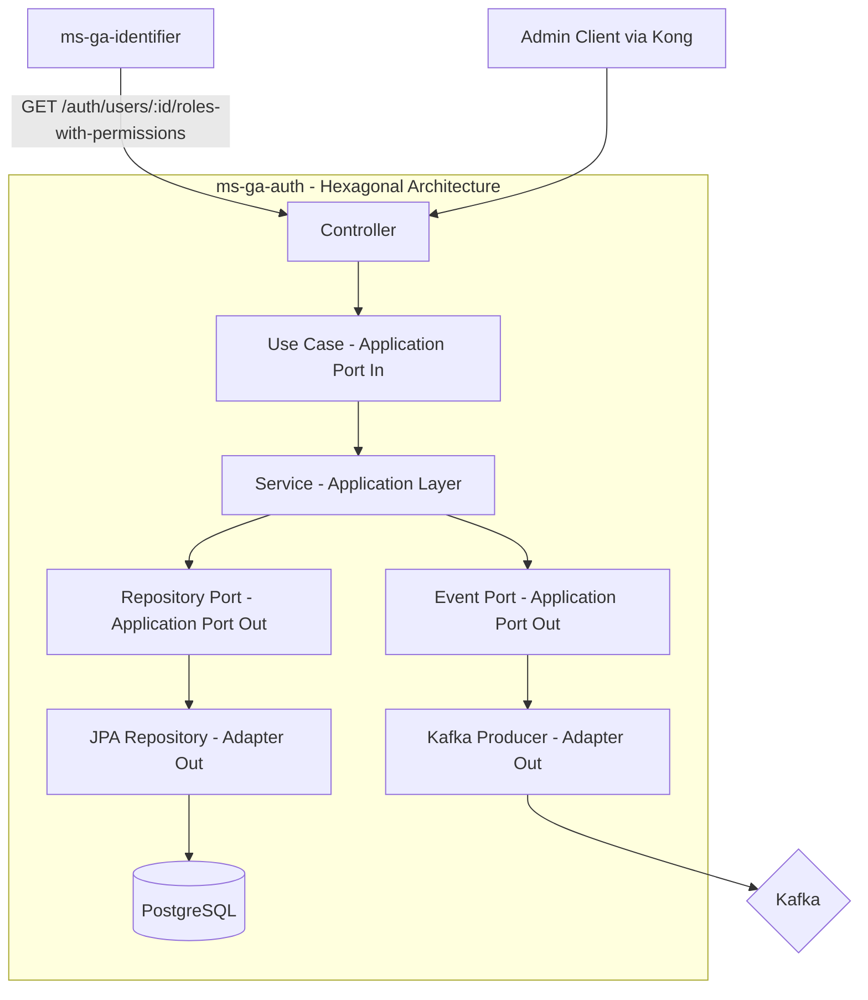

# ms-ga-auth — Authorization Management Service

## Overview

| Property         | Value                                     |
| ---------------- | ----------------------------------------- |
| **Language**     | Java 21                                   |
| **Framework**    | Spring Boot 3.x                           |
| **Database**     | PostgreSQL 15 (Spring Data JPA + Flyway)  |
| **Port**         | 8082                                      |
| **Base Path**    | `/auth`                                   |
| **Architecture** | Hexagonal Architecture (Ports & Adapters) |

**Purpose:** The Authorization Service manages _what you can do_. It is a **management service** for RBAC — defining roles, permissions, and their mappings, and assigning roles to users. It is called by `ms-ga-identifier` at login/refresh time to fetch a user's effective roles and permissions. It is NOT called on every business request — permissions are embedded in the JWT and checked locally by each service.

---

## Architecture Diagram



---

## Project Structure

```
ms-ga-auth/
├── src/
│   ├── main/
│   │   ├── java/com/gymapi/auth/
│   │   │   ├── GaAuthApplication.java
│   │   │   ├── adapter/
│   │   │   │   ├── in/
│   │   │   │   │   └── web/
│   │   │   │   │       ├── controller/
│   │   │   │   │       │   ├── RoleController.java
│   │   │   │   │       │   ├── PermissionController.java
│   │   │   │   │       │   └── UserRoleController.java
│   │   │   │   │       ├── dto/
│   │   │   │   │       │   ├── request/
│   │   │   │   │       │   │   ├── CreateRoleRequest.java
│   │   │   │   │       │   │   ├── UpdateRoleRequest.java
│   │   │   │   │       │   │   ├── CreatePermissionRequest.java
│   │   │   │   │       │   │   └── AssignRoleRequest.java
│   │   │   │   │       │   └── response/
│   │   │   │   │       │       ├── RoleResponse.java
│   │   │   │   │       │       ├── PermissionResponse.java
│   │   │   │   │       │       └── RolesWithPermissionsResponse.java
│   │   │   │   │       └── mapper/
│   │   │   │   │           └── AuthWebMapper.java
│   │   │   │   └── out/
│   │   │   │       ├── persistence/
│   │   │   │       │   ├── entity/
│   │   │   │       │   │   ├── RoleEntity.java
│   │   │   │       │   │   ├── PermissionEntity.java
│   │   │   │       │   │   ├── RolePermissionEntity.java
│   │   │   │       │   │   └── UserRoleEntity.java
│   │   │   │       │   ├── mapper/
│   │   │   │       │   │   └── AuthPersistenceMapper.java
│   │   │   │       │   └── repository/
│   │   │   │       │       ├── RoleJpaRepository.java
│   │   │   │       │       ├── PermissionJpaRepository.java
│   │   │   │       │       └── UserRoleJpaRepository.java
│   │   │   │       └── messaging/
│   │   │   │           └── KafkaEventPublisher.java
│   │   │   ├── application/
│   │   │   │   ├── port/
│   │   │   │   │   ├── in/
│   │   │   │   │   │   ├── RoleUseCase.java
│   │   │   │   │   │   ├── PermissionUseCase.java
│   │   │   │   │   │   └── UserRoleUseCase.java
│   │   │   │   │   └── out/
│   │   │   │   │       ├── RoleRepository.java
│   │   │   │   │       ├── PermissionRepository.java
│   │   │   │   │       └── EventPublisher.java
│   │   │   │   └── service/
│   │   │   │       ├── RoleService.java
│   │   │   │       ├── PermissionService.java
│   │   │   │       └── UserRoleService.java
│   │   │   ├── domain/
│   │   │   │   └── model/
│   │   │   │       ├── Role.java
│   │   │   │       ├── Permission.java
│   │   │   │       ├── UserRole.java
│   │   │   │       └── RolesWithPermissions.java
│   │   │   └── config/
│   │   │       ├── SecurityConfig.java
│   │   │       ├── KafkaConfig.java
│   │   │       └── WebConfig.java
│   │   └── resources/
│   │       ├── application.yml
│   │       ├── application-dev.yml
│   │       └── db/migration/
│   │           ├── V1__create_roles_table.sql
│   │           ├── V2__create_permissions_table.sql
│   │           ├── V3__create_role_permissions_table.sql
│   │           ├── V4__create_user_roles_table.sql
│   │           └── V5__seed_default_roles_and_permissions.sql
│   └── test/
│       └── java/com/gymapi/auth/
├── docker-compose.yml
├── Dockerfile
├── pom.xml
└── README.md
```

---

## Domain Models

### `Role`

```java
public class Role {
    private UUID id;
    private String name;        // e.g. "SUPER_ADMIN", "GYM_ADMIN", "TRAINER", "MEMBER", "STAFF"
    private String description;
    private boolean system;      // true = built-in, cannot be deleted
    private List<Permission> permissions;
    private LocalDateTime createdAt;
    private LocalDateTime updatedAt;
}
```

### `Permission`

```java
public class Permission {
    private UUID id;
    private String resource;    // e.g. "booking", "exercise", "subscription"
    private String action;      // e.g. "read", "create", "update_own", "manage"
    private String description;
    private LocalDateTime createdAt;
}

// Full permission string: Resource + ":" + Action
// e.g. "booking:read", "exercise:create", "subscription:manage"
```

### `UserRole`

```java
public class UserRole {
    private UUID id;
    private UUID userId;       // References user_id in ms-ga-identifier
    private UUID roleId;
    private UUID assignedBy;   // Admin who assigned the role
    private LocalDateTime assignedAt;
}
```

---

## Application Ports (Interfaces)

### `RoleUseCase` (Port In)

```java
public interface RoleUseCase {
    RoleResponse createRole(CreateRoleCommand command);
    RoleResponse getRole(UUID id);
    List<RoleResponse> getAllRoles();
    RoleResponse updateRole(UUID id, UpdateRoleCommand command);
    void deleteRole(UUID id);
    List<PermissionResponse> getRolePermissions(UUID roleId);
    void setRolePermissions(UUID roleId, Set<UUID> permissionIds);
}
```

### `PermissionUseCase` (Port In)

```java
public interface PermissionUseCase {
    PermissionResponse createPermission(CreatePermissionCommand command);
    List<PermissionResponse> getAllPermissions();
    PermissionResponse updatePermission(UUID id, UpdatePermissionCommand command);
    void deletePermission(UUID id);
}
```

### `UserRoleUseCase` (Port In)

```java
public interface UserRoleUseCase {
    void assignRole(AssignRoleCommand command);
    void removeRole(UUID userId, UUID roleId);
    List<RoleResponse> getUserRoles(UUID userId);
    RolesWithPermissions getUserRolesWithPermissions(UUID userId);
}
```

---

## Database Schema

### `roles` table

```sql
CREATE TABLE roles (
    id          UUID PRIMARY KEY DEFAULT gen_random_uuid(),
    name        VARCHAR(50) NOT NULL UNIQUE,
    description TEXT,
    is_system   BOOLEAN NOT NULL DEFAULT FALSE,
    created_at  TIMESTAMPTZ NOT NULL DEFAULT NOW(),
    updated_at  TIMESTAMPTZ NOT NULL DEFAULT NOW()
);

CREATE INDEX idx_roles_name ON roles(name);
```

### `permissions` table

```sql
CREATE TABLE permissions (
    id          UUID PRIMARY KEY DEFAULT gen_random_uuid(),
    resource    VARCHAR(50) NOT NULL,
    action      VARCHAR(50) NOT NULL,
    description TEXT,
    created_at  TIMESTAMPTZ NOT NULL DEFAULT NOW(),
    UNIQUE(resource, action)
);

CREATE INDEX idx_permissions_resource ON permissions(resource);
```

### `role_permissions` table

```sql
CREATE TABLE role_permissions (
    role_id       UUID NOT NULL REFERENCES roles(id) ON DELETE CASCADE,
    permission_id UUID NOT NULL REFERENCES permissions(id) ON DELETE CASCADE,
    assigned_at   TIMESTAMPTZ NOT NULL DEFAULT NOW(),
    PRIMARY KEY (role_id, permission_id)
);
```

### `user_roles` table

```sql
CREATE TABLE user_roles (
    id          UUID PRIMARY KEY DEFAULT gen_random_uuid(),
    user_id     UUID NOT NULL,
    role_id     UUID NOT NULL REFERENCES roles(id) ON DELETE CASCADE,
    assigned_by UUID,
    assigned_at TIMESTAMPTZ NOT NULL DEFAULT NOW(),
    UNIQUE(user_id, role_id)
);

CREATE INDEX idx_user_roles_user_id ON user_roles(user_id);
CREATE INDEX idx_user_roles_role_id ON user_roles(role_id);
```

### Seed Data (V5 migration)

```sql
-- Default Roles
INSERT INTO roles (id, name, description, is_system) VALUES
    (gen_random_uuid(), 'SUPER_ADMIN', 'Full system access', TRUE),
    (gen_random_uuid(), 'GYM_ADMIN', 'Gym management and staff management', TRUE),
    (gen_random_uuid(), 'TRAINER', 'View assigned customers, manage own schedule', TRUE),
    (gen_random_uuid(), 'MEMBER', 'Self-service: bookings, workouts, profile', TRUE),
    (gen_random_uuid(), 'STAFF', 'Front desk operations', TRUE);

-- Default Permissions
INSERT INTO permissions (resource, action, description) VALUES
    ('user', 'manage', 'Full user management'),
    ('customer', 'manage', 'Full customer management'),
    ('customer', 'read', 'View customer profiles'),
    ('customer', 'read_own', 'View own customer profile'),
    ('exercise', 'manage', 'Full exercise management'),
    ('exercise', 'read', 'View exercises'),
    ('routine', 'manage', 'Full routine management'),
    ('routine', 'read', 'View routines'),
    ('routine', 'create', 'Create routines'),
    ('routine', 'update_own', 'Update own routines'),
    ('session', 'read', 'View sessions'),
    ('session', 'create', 'Create sessions'),
    ('booking', 'manage', 'Full booking management'),
    ('booking', 'read', 'View bookings'),
    ('booking', 'create', 'Create bookings'),
    ('booking', 'cancel_own', 'Cancel own bookings'),
    ('trainer', 'manage', 'Full trainer management'),
    ('trainer', 'read', 'View trainer profiles'),
    ('trainer', 'update_own', 'Update own trainer profile'),
    ('subscription', 'manage', 'Full subscription management'),
    ('subscription', 'read_own', 'View own subscription'),
    ('payment', 'manage', 'Full payment management'),
    ('payment', 'read_own', 'View own payment history'),
    ('supplement', 'manage', 'Full supplement management'),
    ('supplement', 'read', 'View supplements'),
    ('supplement', 'order', 'Place supplement orders'),
    ('analytics', 'read', 'View analytics dashboards'),
    ('analytics', 'read_own', 'View own analytics'),
    ('notification', 'manage', 'Full notification management'),
    ('notification', 'read_own', 'View own notifications'),
    ('role', 'manage', 'Manage roles and permissions');

-- Default Role-Permission Mappings
-- SUPER_ADMIN gets all permissions
-- GYM_ADMIN gets all except role:manage
-- TRAINER gets limited permissions
-- MEMBER gets self-service permissions
-- STAFF gets front desk permissions
```

---

## API Endpoints

### Role Management (Admin only)

#### `GET /auth/roles`

```yaml
Response 200:
  success: true
  data:
    roles:
      - id: uuid
        name: string
        description: string
        is_system: boolean
        permission_count: integer
        created_at: datetime
```

#### `POST /auth/roles`

```yaml
Request:
  name: string (required, unique)
  description: string (optional)

Response 201:
  success: true
  data:
    id: uuid
    name: string
    description: string
    is_system: false
    created_at: datetime
```

#### `GET /auth/roles/:id`

```yaml
Response 200:
  success: true
  data:
    id: uuid
    name: string
    description: string
    is_system: boolean
    permissions:
      - id: uuid
        resource: string
        action: string
        description: string
```

#### `PUT /auth/roles/:id`

```yaml
Request:
  name: string (optional)
  description: string (optional)

Response 200:
  success: true
  data: (updated role)

Errors:
  403: Cannot modify system role name
```

#### `DELETE /auth/roles/:id`

```yaml
Response 204

Errors:
  403: Cannot delete system role
  409: Role is assigned to users
```

#### `GET /auth/roles/:id/permissions`

```yaml
Response 200:
  success: true
  data:
    permissions:
      - id: uuid
        resource: string
        action: string
        description: string
```

#### `PUT /auth/roles/:id/permissions`

```yaml
Request:
  permission_ids: [uuid] (replaces all permissions for this role)

Response 200:
  success: true
  data:
    message: "Permissions updated."
    permission_count: integer
```

### Permission Management (Super Admin only)

#### `GET /auth/permissions`

```yaml
Response 200:
  success: true
  data:
    permissions:
      - id: uuid
        resource: string
        action: string
        description: string
        full_name: "resource:action"
```

#### `POST /auth/permissions`

```yaml
Request:
  resource: string (required)
  action: string (required)
  description: string (optional)

Response 201:
  success: true
  data:
    id: uuid
    resource: string
    action: string
    full_name: "resource:action"
```

### User-Role Management

#### `GET /auth/users/:userId/roles`

```yaml
Response 200:
  success: true
  data:
    user_id: uuid
    roles:
      - id: uuid
        name: string
        assigned_at: datetime
```

#### `POST /auth/users/:userId/roles`

```yaml
Request:
  role_id: uuid (required)

Response 201:
  success: true
  data:
    message: "Role assigned."
    user_id: uuid
    role_id: uuid
    role_name: string

Errors:
  404: Role not found
  409: User already has this role
```

#### `DELETE /auth/users/:userId/roles/:roleId`

```yaml
Response 200:
  success: true
  data:
    message: "Role removed."

Errors:
  404: User does not have this role
```

#### `GET /auth/users/:userId/roles-with-permissions` _(Internal — called by ms-ga-identifier)_

```yaml
Response 200:
  success: true
  data:
    user_id: uuid
    roles: ["MEMBER"]
    permissions: ["booking:read", "booking:create", "exercise:read", ...]

Note: Permissions are flattened and deduplicated across all assigned roles.
```

---

## Default Role-Permission Mappings

### SUPER_ADMIN

All permissions.

### GYM_ADMIN

```
user:manage, customer:manage, exercise:manage, routine:manage,
booking:manage, trainer:manage, subscription:manage, payment:manage,
supplement:manage, analytics:read, notification:manage, role:read
```

### TRAINER

```
customer:read, exercise:read, routine:read, session:read,
booking:read, trainer:update_own, analytics:read_own, notification:read_own
```

### MEMBER

```
customer:read_own, exercise:read, routine:read, routine:create, routine:update_own,
session:read, session:create, booking:read, booking:create, booking:cancel_own,
trainer:read, subscription:read_own, payment:read_own,
supplement:read, supplement:order, analytics:read_own, notification:read_own
```

### STAFF

```
customer:read, exercise:read, booking:read, trainer:read,
subscription:read_own, supplement:read, notification:read_own
```

---

## Kafka Events Published

### `auth.role_assigned`

```json
{
  "event_type": "auth.role_assigned",
  "source": "ms-ga-auth",
  "data": {
    "user_id": "uuid",
    "role_id": "uuid",
    "role_name": "MEMBER",
    "assigned_by": "uuid"
  }
}
```

### `auth.role_revoked`

```json
{
  "event_type": "auth.role_revoked",
  "source": "ms-ga-auth",
  "data": {
    "user_id": "uuid",
    "role_id": "uuid",
    "role_name": "MEMBER"
  }
}
```

### `auth.permission_changed`

```json
{
  "event_type": "auth.permission_changed",
  "source": "ms-ga-auth",
  "data": {
    "role_id": "uuid",
    "role_name": "MEMBER",
    "change_type": "permissions_updated"
  }
}
```

---

## Spring Boot Configuration

### `application.yml`

```yaml
server:
  port: 8082

spring:
  application:
    name: ms-ga-auth
  datasource:
    url: jdbc:postgresql://${DB_HOST:localhost}:${DB_PORT:5432}/${DB_NAME:auth_db}
    username: ${DB_USER:postgres}
    password: ${DB_PASS:postgres}
    driver-class-name: org.postgresql.Driver
  jpa:
    hibernate:
      ddl-auto: validate
    show-sql: false
    properties:
      hibernate:
        dialect: org.hibernate.dialect.PostgreSQLDialect
        format_sql: true
  flyway:
    enabled: true
    locations: classpath:db/migration

kafka:
  bootstrap-servers: ${KAFKA_BROKERS:localhost:9092}
  topic:
    auth: auth.events

jwt:
  secret: ${JWT_SECRET}

logging:
  level:
    com.gymapi.auth: INFO
  pattern:
    console: '{"timestamp":"%d","level":"%p","service":"ms-ga-auth","correlation_id":"%X{correlationId}","message":"%m"}%n'
```

### `pom.xml` Key Dependencies

```xml
<dependencies>
    <dependency>
        <groupId>org.springframework.boot</groupId>
        <artifactId>spring-boot-starter-web</artifactId>
    </dependency>
    <dependency>
        <groupId>org.springframework.boot</groupId>
        <artifactId>spring-boot-starter-data-jpa</artifactId>
    </dependency>
    <dependency>
        <groupId>org.springframework.boot</groupId>
        <artifactId>spring-boot-starter-validation</artifactId>
    </dependency>
    <dependency>
        <groupId>org.springframework.kafka</groupId>
        <artifactId>spring-kafka</artifactId>
    </dependency>
    <dependency>
        <groupId>org.postgresql</groupId>
        <artifactId>postgresql</artifactId>
    </dependency>
    <dependency>
        <groupId>org.flywaydb</groupId>
        <artifactId>flyway-core</artifactId>
    </dependency>
    <dependency>
        <groupId>org.mapstruct</groupId>
        <artifactId>mapstruct</artifactId>
    </dependency>
    <dependency>
        <groupId>org.projectlombok</groupId>
        <artifactId>lombok</artifactId>
    </dependency>
</dependencies>
```

---

## Docker Compose (Development)

```yaml
version: "3.8"

services:
  app:
    build: .
    ports:
      - "8082:8082"
    environment:
      - DB_HOST=db
      - KAFKA_BROKERS=kafka:9092
    depends_on:
      db:
        condition: service_healthy

  db:
    image: postgres:15-alpine
    environment:
      POSTGRES_USER: postgres
      POSTGRES_PASSWORD: postgres
      POSTGRES_DB: auth_db
    ports:
      - "5434:5432"
    healthcheck:
      test: ["CMD-SHELL", "pg_isready -U postgres -d auth_db"]
      interval: 5s
      timeout: 5s
      retries: 5

  flyway:
    image: flyway/flyway
    command: -url=jdbc:postgresql://db:5432/auth_db -user=postgres -password=postgres -connectRetries=60 migrate
    volumes:
      - ./db/migrations:/flyway/sql
    depends_on:
      db:
        condition: service_healthy
```
